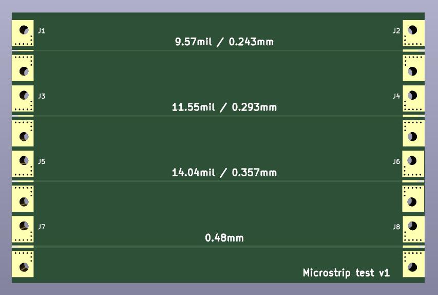

# Microstrip test

This is a board to test microstrip & connector launch dimensions, for JLCPCB's 7628 stackup. It uses the Rosenberger 32K243-40ML5 edge-launch SMA connector.

The even-numbered connectors use Rosenberger's suggested footprint as-is, and the odd-numbered connectors resize the signal trace to match the microstrip.
It has traces designed for 45, 50, and 55 ohms based on JLCPCB's calculator and includes a fourth trace that matches the Rosenberger footprint
