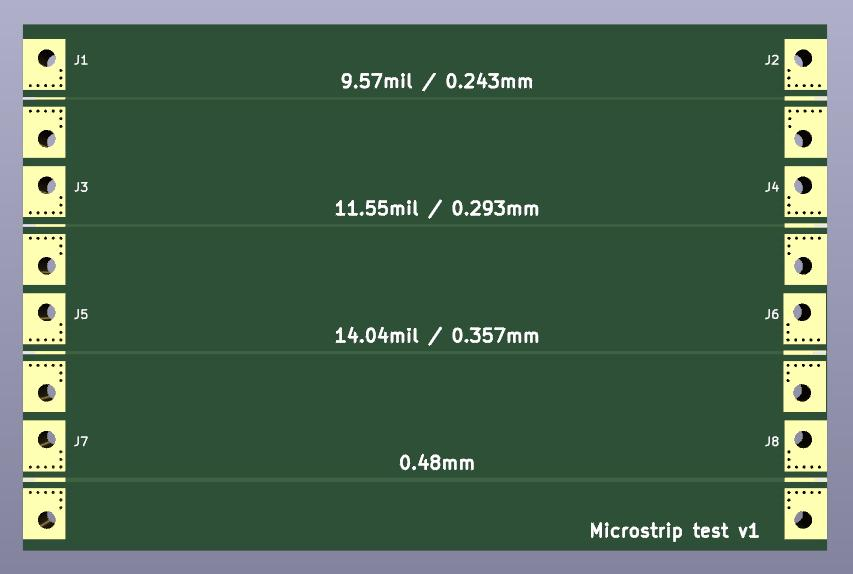
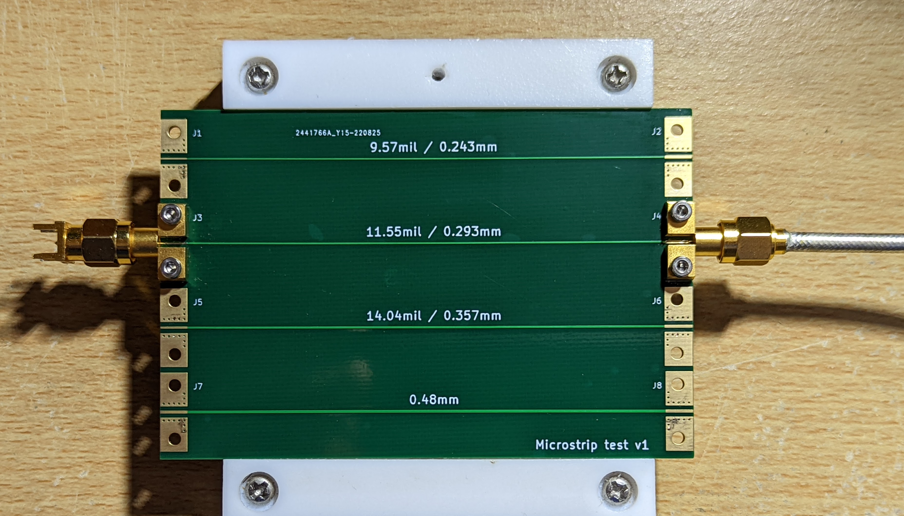
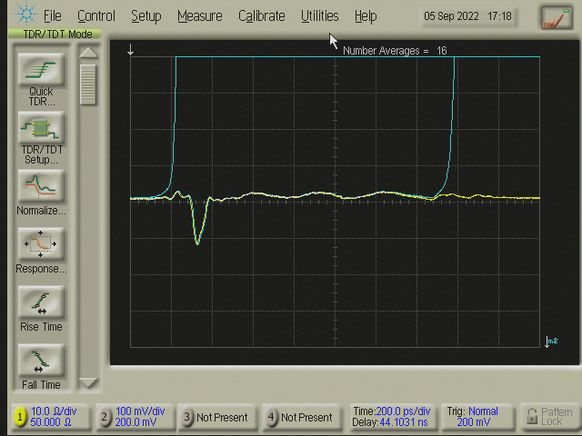
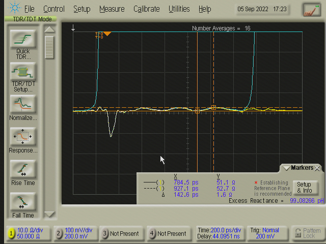

# Microstrip test

This is a board to test microstrip & connector launch dimensions for JLCPCB's 7628 stackup. It uses the Rosenberger 32K243-40ML5 edge-launch SMA connector.

The even-numbered connectors use Rosenberger's suggested footprint as-is, and the odd-numbered connectors resize the signal trace to match the microstrip.
It has traces designed for 45, 50, and 55 ohms based on JLCPCB's calculator and includes a fourth trace that matches the Rosenberger footprint

## Results

### Test setup

The 50 ohm trace was populated and tested using an Agilent 86100A & 54754A TDR module connected to J4, with a 50 ohm load connected to J3.

The TDR response is shown below. The first blue waveform was captured with J4 disconnected, and the second blue waveform was captured with J4 connected and J3 disconnected - this helps to visualise where the DUT lies in time.
The response shows a drop in impedance at the J4 footprint, due to the wider trace in the suggested footprint. After that the microstrip is nominally 50 ohm with some variation, likely due to the fiber weave. The adjusted trace width on the J3 footprint seems to be a good match and maintains ~50 ohms through to the load.

Adding some markers shows that the microstrip varies between ~51.1 and 52.7 ohms. It may be possible to tune for a better match but it will depend on the range of manufacturing variation.

